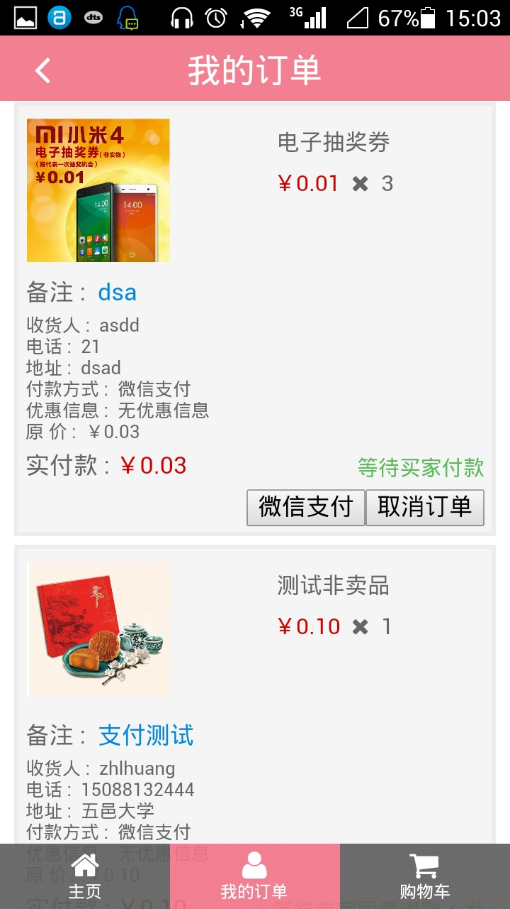
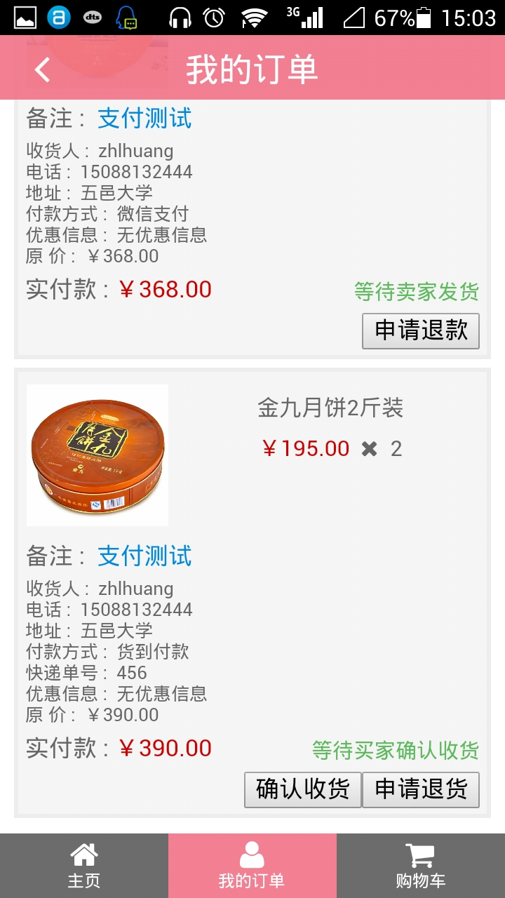

# emshop

> A fork of [mshop](https://github.com/fritx/mshop)

Another online shop(mall) highly adapted to mobiles

## Features

- Also as Real Products: [江门邮政电商](http://www.jmyzds.com/store), [Great Me](http://greatme.org) (Much Better on Mobile)
- PureCSS like Web Designing
- Highly Built with Gulp
- Completely Switched to Jade/JST

## Screenshots

&nbsp;&nbsp;
&nbsp;&nbsp;
&nbsp;&nbsp;

&nbsp;&nbsp;
&nbsp;&nbsp;
&nbsp;&nbsp;

## Wiki (in zh-CN)

See <https://github.com/fritx/emshop/wiki/1.-环境搭建>
